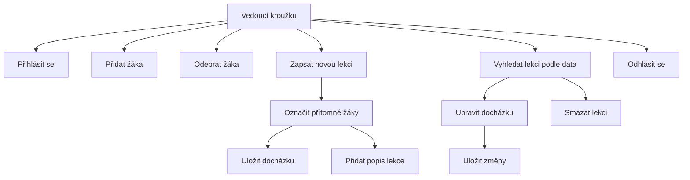

# Docházka šermu

Webová aplikace pro správu docházky šermířského kroužku. Vedoucí kroužku může spravovat seznam žáků, zapisovat docházku na lekcích a zpětně vyhledávat záznamy podle data. Aplikace podporuje více uživatelů přes přihlašovací systém.

---

## Účel aplikace

Aplikace slouží vedoucím šermířského kroužku ke správě docházky. Umožňuje přidávat a odebírat žáky, zapisovat přítomnost na každé lekci a dohledat historické záznamy. Data jsou uložena v cloudové databázi Supabase — přístupná z libovolného zařízení po přihlášení.

---

## Struktura projektu

```
dochazka_proj/
├── icons/                  # Ikony pro PWA
├── index.html              # Hlavní stránka aplikace
├── login.html              # Přihlašovací stránka
├── style.css               # Styly aplikace
├── script.js               # Logika hlavní stránky
├── login.js                # Logika přihlašování
├── sw.js                   # Service worker pro PWA
├── manifest.json           # Manifest pro PWA
└── README.md               # Dokumentace
```

---

## Použité technologie

- **HTML / CSS / JavaScript** — frontend aplikace
- **Supabase** — cloudová databáze a autentizace, REST API
- **localStorage** — ukládání session tokenu po přihlášení
- **PWA** — manifest.json + service worker pro offline režim a instalaci na plochu

---

## Přihlašovací systém

Aplikace používá Supabase Auth. Po přihlášení se token uloží do localStorage a posílá se s každým API requestem. Nepřihlášený uživatel je automaticky přesměrován na `login.html`. Nové účty vytváří pouze administrátor — volná registrace je zakázána.

---

## API endpointy

Aplikace komunikuje se Supabase REST API. Základní URL: `https://<projekt>.supabase.co/rest/v1/`

| Metoda | Endpoint | Popis |
|--------|----------|-------|
| `GET` | `/students?select=*` | Načte seznam všech žáků |
| `POST` | `/students` | Přidá nového žáka |
| `DELETE` | `/students?id=eq.{id}` | Smaže žáka podle ID |
| `GET` | `/sessions?date=eq.{datum}&select=*` | Načte lekci podle data |
| `POST` | `/sessions` | Vytvoří novou lekci |
| `PATCH` | `/sessions?id=eq.{id}` | Aktualizuje popis lekce |
| `DELETE` | `/sessions?id=eq.{id}` | Smaže lekci podle ID |
| `GET` | `/attendance?session_id=eq.{id}&select=*` | Načte docházku pro lekci |
| `POST` | `/attendance` | Uloží záznamy docházky |
| `DELETE` | `/attendance?session_id=eq.{id}` | Smaže docházku pro lekci |

Autentizace probíhá přes: `POST /auth/v1/token?grant_type=password`

---

## Princip fungování

### Přihlášení
Po zadání emailu a hesla se pošle POST request na Supabase Auth. Vrácený token se uloží do localStorage. Každý následující request na API posílá token v hlavičce `Authorization`.

### JavaScript a DOM
Veškerá logika je v `script.js`. Po načtení stránky se zkontroluje přihlášení, načtou se žáci ze Supabase a zobrazí v seznamu. JavaScript dynamicky vytváří HTML elementy podle dat z databáze — řádky tabulky, položky seznamu.

### Supabase REST API
Komunikace s databází probíhá přes `fetch()` s HTTP metodami GET, POST, PATCH a DELETE. Data se posílají a přijímají ve formátu JSON.

### localStorage
localStorage ukládá session token po přihlášení. Hlavní data (žáci, lekce, docházka) jsou uložena v Supabase.

### PWA
Aplikace je Progressive Web App — lze ji přidat na plochu zařízení. `manifest.json` definuje název, ikonu a způsob zobrazení. Service worker (`sw.js`) ukládá soubory do cache pro offline režim.

---

## Databázová struktura

### Tabulka `students`
| Sloupec | Typ | Popis |
|---------|-----|-------|
| `id` | int8 | Unikátní identifikátor |
| `created_at` | timestamp | Datum přidání |
| `name` | text | Jméno žáka |

### Tabulka `sessions`
| Sloupec | Typ | Popis |
|---------|-----|-------|
| `id` | int8 | Unikátní identifikátor |
| `created_at` | timestamp | Datum vytvoření záznamu |
| `date` | text | Datum lekce |
| `desc` | text | Popis lekce |

### Tabulka `attendance`
| Sloupec | Typ | Popis |
|---------|-----|-------|
| `id` | int8 | Unikátní identifikátor |
| `created_at` | timestamp | Datum vytvoření záznamu |
| `session_id` | int8 | ID lekce |
| `student_id` | int8 | ID žáka |
| `present` | bool | Přítomen ano/ne |

---

## Use-case diagram



---

## Možná rozšíření

- Statistiky docházky pro každého žáka (procento přítomnosti)
- Export docházky do PDF nebo CSV
- Notifikace při nízké docházce žáka
- Role uživatelů (admin, vedoucí, čtenář)
